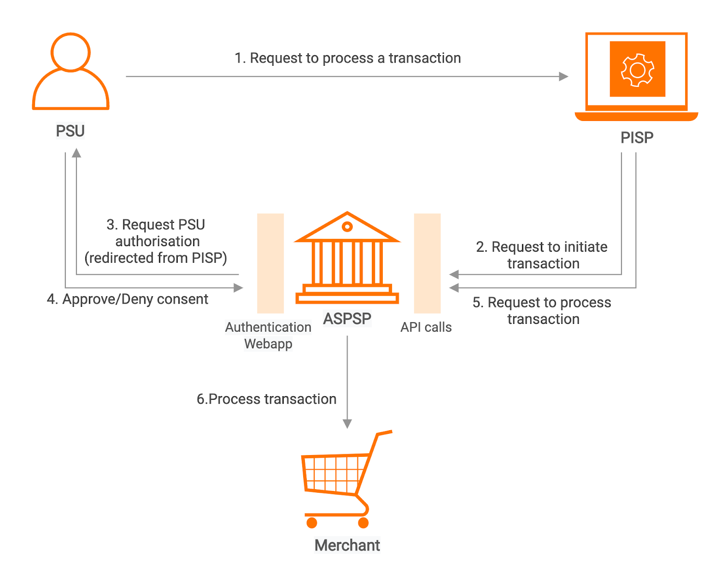

!!!info
    Some content in this documentation is subject to the [MIT Open Licence](https://www.openbanking.org.uk/open-licence/).
    For further information, see [Copyright and Licence](copyright-and-licence.md).

## Introduction

This page explains the flow of the [Payment Initiation API by OBIE](https://openbankinguk.github.io/read-write-api-site3/v3.1.10/profiles/payment-initiation-api-profile.html). 
The API endpoints described here allow a PISP to: 

- Register a payment-order consent. 
- Optionally confirm available funds for a payment-order (domestic and international immediate payments only). 
- Subsequently, submit the payment-order for processing. 
- Optionally retrieve the status of a payment-order consent or payment-order resource.

## Basic flow

The diagram below shows the basic payment flow (using the Payment APIs) for all payment-order types:

PSU requests the PISP to process a transaction. The consent is between the PSU and the PISP. The PISP connects to the 
ASPSP that services the PSU's payment account and requests the ASPSP to initiate the transaction, a payment-order consent 
is created. The PISP requests the PSU to authorise the consent. The ASPSP may carry this out by using a redirection flow.

In a redirection flow, the PISP redirects the PSU to the ASPSP.

1. The redirect includes the `ConsentId` generated in the previous step.
2. This allows the ASPSP to correlate the payment order consent that was setup.
3. The ASPSP authenticates the PSU.
4. The PSU selects the debtor account at this stage (if it has not been previously specified).
5. The ASPSP updates the state of the payment order consent resource internally to indicate that the consent has been authorised.
6. Once the consent has been authorised, the PSU is redirected back to the PISP.

Then the PSU approves the consent. The PISP may optionally invoke the following APIs during the flow:

- Confirm available funds for a payment-order - Using an access token of the Client Credentials grant type.
- Retrieve the status of a payment-order consent or payment-order resource - Using an access token of the Authorization Code grant type.

!!!note
    The payment-order consent and payment-order resource is generalised for the different payment-order types. For example, for a 
    domestic payment, the payment-order consent resource is `domestic-payment-consents`, and the payment-order resource is `domestic-payments`. 

For more information, see [Payment Initiation API Flow](../try-out/payment-initiation-flow.md).

## Endpoints

Once you deploy the Payment Initiation API, you can access payment information via the following API endpoints:

<table>
<thead>
  <tr>
    <th>Endpoint Name</th>
    <th>Supported Version</th>
    <th>Resource</th>
    <th>Endpoint URL</th>
    <th>Mandatory/Optional</th>
  </tr>
</thead>
<tbody>
  <tr>
    <td rowspan="5">Domestic Payments</td>
    <td rowspan="5">v3.1.5 v3.1.6 v3.1.8 v3.1.9 v3.1.10</td>
    <td rowspan="3"><code>domestic-payment-consents</code></td>
    <td><code>POST /domestic-payment-consents</code></td>
    <td>Mandatory</td>
  </tr>
  <tr>
    <td><code>GET /domestic-payment-consents/{ConsentId}</code></td>
    <td>Mandatory</td>
  </tr>
  <tr>
    <td><code>GET /domestic-payment-consents/{ConsentId}/funds-confirmation</code></td>
    <td>Mandatory</td>
  </tr>
  <tr>
    <td rowspan="2"><code>domestic-payments</code></td>
    <td><code>POST /domestic-payments</code></td>
    <td>Mandatory</td>
  </tr>
  <tr>
    <td><code>GET /domestic-payments/{DomesticPaymentId}</code></td>
    <td>Mandatory</td>
  </tr>
  <tr>
    <td rowspan="4">Domestic Scheduled Payment</td>
    <td rowspan="4">v3.1.5 v3.1.6 v3.1.8 v3.1.9 v3.1.10</td>
    <td rowspan="2"><code>domestic-scheduled-payment-consents</code></td>
    <td><code>POST /domestic-scheduled-payment-consents</code></td>
    <td>Conditional</td>
  </tr>
  <tr>
    <td><code>GET /domestic-scheduled-payment-consents/{ConsentId}</code></td>
    <td>Mandatory (if resource POST implemented)</td>
  </tr>
  <tr>
    <td rowspan="2"><code>domestic-scheduled-payments</code></td>
    <td><code>POST /domestic-scheduled-payments</code></td>
    <td>Conditional</td>
  </tr>
  <tr>
    <td><code>GET /domestic-scheduled-payments/{DomesticScheduledPaymentId}</code></td>
    <td>Mandatory (if resource POST implemented)</td>
  </tr>
  <tr>
    <td rowspan="4">Domestic Standing Orders</td>
    <td rowspan="4">v3.1.5 v3.1.6 v3.1.8 v3.1.9 v3.1.10</td>
    <td rowspan="2"><code>domestic-standing-order-consents</code></td>
    <td><code>POST /domestic-standing-order-consents</code></td>
    <td>Conditional</td>
  </tr>
  <tr>
    <td><code>GET /domestic-standing-order-consents/{ConsentId}</code></td>
    <td>Mandatory (if resource POST implemented)</td>
  </tr>
  <tr>
    <td rowspan="2"><code>domestic-standing-orders</code></td>
    <td><code>POST /domestic-standing-orders</code></td>
    <td>Conditional</td>
  </tr>
  <tr>
    <td><code>GET /domestic-standing-orders/{DomesticStandingOrderId}</code></td>
    <td>Mandatory (if resource POST implemented)</td>
  </tr>
  <tr>
    <td rowspan="5">International Payments</td>
    <td rowspan="5">v3.1.5 v3.1.6 v3.1.8 v3.1.9 v3.1.10</td>
    <td rowspan="3"><code>international-payment-consents</code></td>
    <td><code>POST /international-payment-consents</code></td>
    <td>Conditional</td>
  </tr>
  <tr>
    <td><code>GET /international-payment-consents/{ConsentId}</code></td>
    <td>Mandatory (if resource POST implemented)</td>
  </tr>
  <tr>
    <td><code>GET /international-payment-consents/{ConsentId}/funds-confirmation</td>
    <td>Mandatory (if resource POST implemented)</td>
  </tr>
  <tr>
    <td rowspan="2"><code>international-payments</code></td>
    <td><code>POST /international-payments</code></td>
    <td>Conditional</td>
  </tr>
  <tr>
    <td><code>GET /international-payments/{InternationalPaymentId}</code></td>
    <td>Mandatory (if resource POST implemented)</td>
  </tr>
  <tr>
    <td rowspan="5">International Scheduled Payments</td>
    <td rowspan="5">v3.1.5 v3.1.6 v3.1.8 v3.1.9 v3.1.10</td>
    <td rowspan="3"><code>international-scheduled-payment-consents</code></td>
    <td><code>POST /international-scheduled-payment-consents</code></td>
    <td>Conditional</td>
  </tr>
  <tr>
    <td><code>GET /international-scheduled-payment-consents/{ConsentId}</code></td>
    <td>Mandatory (if resource POST implemented)</td>
  </tr>
  <tr>
    <td><code>GET /international-scheduled-payment-consents/{ConsentId}/funds-confirmation</code></td>
    <td>Mandatory (if immediate debit supported)</td>
  </tr>
  <tr>
    <td rowspan="2"><code>international-scheduled-payments</code></td>
    <td><code>POST /international-scheduled-payments</code></td>
    <td>Conditional</td>
  </tr>
  <tr>
    <td><code>GET /international-scheduled-payments/{InternationalScheduledPaymentId}</code></td>
    <td>Mandatory (if resource POST implemented)</td>
  </tr>
  <tr>
    <td rowspan="4">International Standing Orders</td>
    <td rowspan="4">v3.1.5 v3.1.6 v3.1.8 v3.1.9 v3.1.10</td>
    <td rowspan="2"><code>international-standing-order-consents</code></td>
    <td><code>POST /international-standing-order-consents</code></td>
    <td>Conditional</td>
  </tr>
  <tr>
    <td><code>GET /international-standing-order-consents/{ConsentId}</code></td>
    <td>Mandatory (if resource POST implemented)</td>
  </tr>
  <tr>
    <td rowspan="2"><code>international-standing-orders</code></td>
    <td><code>POST /international-standing-orders</code></td>
    <td>Conditional</td>
  </tr>
  <tr>
    <td><code>GET /international-standing-orders/{InternationalStandingOrderPaymentId}</code></td>
    <td>Mandatory (if resource POST implemented)</td>
  </tr>
  <tr>
    <td rowspan="7">File Payments</td>
    <td rowspan="7">v3.1.5 v3.1.6 v3.1.8 v3.1.9 v3.1.10</td>
    <td rowspan="4"><code>file-payment-consents</code></td>
    <td><code>POST /file-payment-consents</code></td>
    <td>Conditional</td>
  </tr>
  <tr>
    <td><code>GET /file-payment-consents/{ConsentId}</code></td>
    <td>Conditional</td>
  </tr>
  <tr>
    <td><code>POST /file-payment-consents/{ConsentId}/file</code></td>
    <td>Mandatory (if resource POST implemented)</td>
  </tr>
  <tr>
    <td><code>GET /file-payment-consents/{ConsentId}/file</code></td>
    <td>Conditional</td>
  </tr>
  <tr>
    <td rowspan="3"><code>file-payments</code></td>
    <td><code>POST /file-payments</code></td>
    <td>Conditional</td>
  </tr>
  <tr>
    <td><code>GET /file-payments/{FilePaymentId}</code></td>
    <td>Mandatory (if resource POST implemented)</td>
  </tr>
  <tr>
    <td><code>GET /file-payments/{FilePaymentId}/report-file</code></td>
    <td>Conditional</td>
  </tr>
</tbody>
</table>